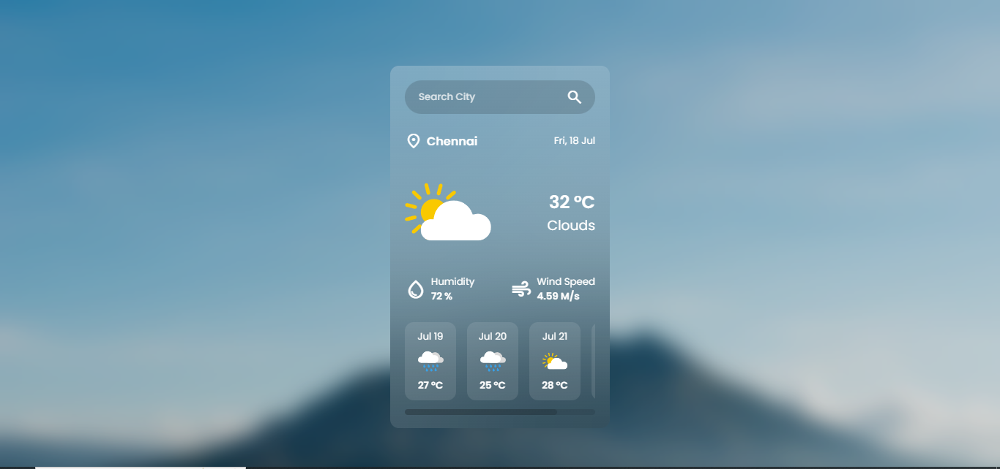

# 🌤️ Weather App

A responsive and minimalistic weather forecast web application built using **HTML**, **CSS**, and **JavaScript**. It fetches **real-time weather data** using the **OpenWeatherMap API** and presents current and 5-day forecast weather information in a clean UI.

🔗 **Live Demo:** [View Weather App](https://selvarajan-m.github.io/weather-app/)

---

## 📌 Features

- 🌍 Search weather by **city name**
- 🌡️ Displays:
  - Current temperature (in °C)
  - Weather condition (e.g., Clouds, Clear, Rain)
  - Humidity and wind speed
- 📆 Shows **5-day weather forecast**
- ✅ Validates user input and handles invalid city names
- 🧊 **Glassmorphism UI** design for modern aesthetics
- 📱 Fully responsive for mobile and desktop

---

## 🖼️ Preview



---

## 🛠️ Tech Stack

| Technology     | Description                    |
|----------------|--------------------------------|
| HTML5          | Page structure and content     |
| CSS3           | Styling and layout             |
| JavaScript     | Dynamic data fetching & logic  |
| OpenWeatherMap | API for weather data           |

---

## 📁 Project Structure

```
weather-app/
│
├── index.html            # HTML structure
├── style.css             # Stylesheet (Glassmorphism UI)
├── script.js             # JavaScript logic and API calls
├── assets/               # Images and icons
│   ├── bg.jpg
│   ├── message/
│   │   ├── search-city.png
│   │   └── not-found.png
│   └── weather/
│       ├── clear.svg
│       ├── clouds.svg
│       ├── rain.svg
│       ├── thunderstorm.svg
│       ├── drizzle.svg
│       ├── snow.svg
│       └── atmosphere.svg
```

---

## 🔧 How to Use Locally

1. **Clone the repository:**

```bash
git clone https://github.com/selvarajan-m/weather-app.git
cd weather-app
```

2. **Replace the API key** in `script.js`:

```javascript
const apiKey = 'YOUR_API_KEY_HERE';
```

> You can get a free API key from [https://openweathermap.org/](https://openweathermap.org/)

3. **Open `index.html`** in your browser to run the app.

---

## 📦 API Reference

- **Current Weather API**:  
  `https://api.openweathermap.org/data/2.5/weather`

- **5-Day Forecast API**:  
  `https://api.openweathermap.org/data/2.5/forecast`

---

## 📃 License

This project is licensed under the **MIT License** – free to use and modify.

---

## 🙌 Author

**Selvarajan M**  
[GitHub Profile](https://github.com/selvarajan-m)
